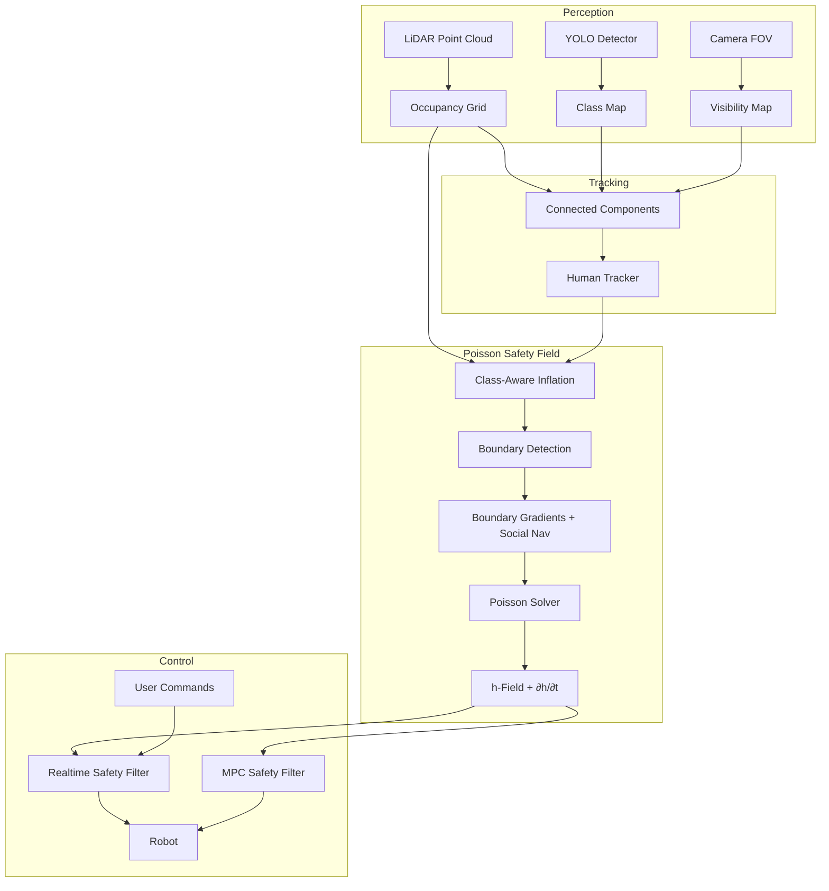

# Semantic Safety Filter

A comprehensive real-time safety system that combines **Control Barrier Functions (CBF)** with **semantic perception** to enable safe navigation around obstacles and humans. The system features two complementary safety mechanisms:

1. **Realtime Safety Filter** — Analytical CBF-based single-integrator filter for immediate safety enforcement
2. **MPC Safety Filter** — Model Predictive Control with CBF constraints for optimal trajectory planning



---

## Mathematical Foundations

### Control Barrier Functions (CBF)

A function $h: \mathbb{R}^n \to \mathbb{R}$ is a **Control Barrier Function** if there exists an extended class-$\mathcal{K}_\infty$ function $\alpha$ such that for the control affine system $\dot{x} = f(x) + g(x)u$:

$$\sup_{u \in U} \left[ L_f h(x) + L_g h(x) u \right] \geq -\alpha(h(x))$$

The **safe set** $\mathcal{C}$ is defined as:

$$\mathcal{C} = \{ x \in \mathbb{R}^n : h(x) \geq 0 \}$$

### Poisson Safety Field

The safety function $h(x, y, \theta)$ is computed by solving **Poisson's equation**:

$$\nabla^2 h = -f$$

with **Dirichlet boundary conditions**:

$$h\big|_{\partial \mathcal{O}} = 0$$

where $\partial \mathcal{O}$ represents obstacle boundaries and $f$ is the forcing function derived from the guidance field.

The h-field provides:

- $h > 0$: Safe region (free space)
- $h = 0$: Boundary (obstacle edge)
- $h < 0$: Unsafe region (inside obstacle)

### Guidance Field

The guidance field $\mathbf{v} = (v_x, v_y)$ is computed by solving **Laplace's equation**:

$$\nabla^2 \mathbf{v} = 0$$

with boundary conditions set by the normalized gradient pointing away from obstacles, scaled by class-specific magnitudes $\nabla h_0$.

---

## Realtime Safety Filter

The analytical CBF-based filter runs at state update rate (~500Hz) providing immediate safety interventions.

### CBF-QP Formulation

Given desired velocity $\mathbf{u}_d$, the safe velocity $\mathbf{u}$ is found by solving:

$$
\begin{aligned}
\min_{\mathbf{u} \in \mathbb{R}^3} \quad & \frac{1}{2} (\mathbf{u} - \mathbf{u}_d)^T P (\mathbf{u} - \mathbf{u}_d) \\
\text{s.t.} \quad & \underbrace{L_g h(\mathbf{x})}_{\nabla h^T} \mathbf{u} + \underbrace{L_f h(\mathbf{x}) + \alpha(h(\mathbf{x}))}_{\text{drift + decay}} \geq 0
\end{aligned}
$$

where $P = \text{diag}(P_x, P_y, P_\psi)$ is the input penalty matrix.

### Analytical Solution (Sontag Formula)

The closed-form solution uses the **Sontag universal formula**:

$$\mathbf{u} = \mathbf{u}_d + \lambda \cdot P^{-1} \nabla h$$

where the Lagrange multiplier $\lambda$ is:

$$\lambda = \frac{-a + \sqrt{a^2 + \sigma b^2}}{2b}$$

with:

- $a$: Activating function
- $b = \nabla h^T P^{-1} \nabla h$: Gradient norm weighted by input penalty
- $\sigma$: Sontag smoothing parameter (default $1.0$)

### Activating Function (Dynamic CBF with ISSf)

The activating function from **Equation 31** incorporates dynamic obstacle handling:

$$a = \underbrace{\mathbf{v} \cdot \mathbf{u}_d}_{\text{guidance alignment}} + \underbrace{\frac{\|\mathbf{v}\|}{\|\nabla h\| + \sigma(h)} \cdot \frac{\partial h}{\partial t}}_{\text{scaled temporal derivative}} + \underbrace{\gamma \cdot h}_{\text{class-}\mathcal{K}_\alpha} - \underbrace{\text{ISSf}}_{\text{robustness}}$$

| Term                | Symbol                                                          | Description                                   |
| ------------------- | --------------------------------------------------------------- | --------------------------------------------- |
| Guidance alignment  | $\mathbf{v} \cdot \mathbf{u}_d$                                 | Nominal control projected onto guidance field |
| Temporal derivative | $\frac{\|\mathbf{v}\|}{\|\nabla h\| + \sigma(h)} \cdot \dot{h}$ | Dynamic obstacle compensation                 |
| Class-Kα            | $\gamma h$                                                      | Exponential convergence to safe set           |
| ISSf                | $\text{ISSf}$                                                   | Input-to-State Safety margin                  |

### Sigma Scaling Function

Prevents numerical instability near the boundary:

$$\sigma(h) = \varepsilon \left( 1 - e^{-\kappa \cdot \max(0, h)} \right)$$

**Properties:**

- $\sigma(0) = 0$ (no regularization at boundary)
- $\sigma(\infty) \to \varepsilon$ (saturates far from boundary)
- $\kappa$ controls transition rate

### Input-to-State Safety (ISSf)

Provides robustness to disturbances:

$$\text{ISSf} = \sigma_{\text{act}} \left( \frac{\|\nabla h\|}{\text{ISSf}_1} + \frac{\|\nabla h\|^2}{\text{ISSf}_2} \right)$$

where $\sigma_{\text{act}} = \text{clamp}(-10 \cdot \dot{h}, 0, 1)$ activates when $h$ is decreasing.

### Implementation

```cpp
// Gradient from guidance field (control direction)
float dhdx = vx;  // guidance_x
float dhdy = vy;  // guidance_y

// Numerical dhdq from h-field
float dhdq = (h(q+) - h(q-)) / (2 * Δq);

// Gradient norm from h-field (for sigma scaling)
float Dh_norm = sqrt(Dhx² + Dhy² + dhdq²);

// Sigma function
float sigma_h = ε * (1 - exp(-κ * max(0, h)));

// dhdt scaling factor
float dhdt_scale = min(||v|| / (||Dh|| + σ(h) + ε), 1.0);

// Activating function
float a = wn * h + vx*vd[0] + vy*vd[1] + dhdt_scale*dhdt + dhdq*vd[2] - ISSf;

// Weighted gradient norm
float b = dhdx²/Px + dhdy²/Py + dhdq²/Pψ;

// Sontag multiplier
float λ = (-a + sqrt(a² + σ*b²)) / (2*b);

// Safe velocity
v[0] = vd[0] + λ * dhdx / Px;
v[1] = vd[1] + λ * dhdy / Py;
v[2] = vd[2] + λ * dhdq / Pψ;
```

### Parameters

| Parameter           | Symbol        | Default     | Description                  |
| ------------------- | ------------- | ----------- | ---------------------------- |
| `wn`                | $\gamma$      | `1.0`       | Class-Kα decay rate          |
| `issf`              | ISSf          | `5.0`       | Input-to-State Safety factor |
| `cbf_sigma_epsilon` | $\varepsilon$ | `0.1`       | Sigma saturation value       |
| `cbf_sigma_kappa`   | $\kappa$      | `5.0`       | Sigma transition rate        |
| `Pu`                | $P$           | `[2, 2, 1]` | Input penalty diagonal       |

---

## MPC Safety Filter

The Model Predictive Controller solves a finite-horizon constrained optimization problem.

### Discrete-Time Dynamics

Single integrator in 3D:

$$\mathbf{x}_{k+1} = \mathbf{x}_k + \Delta t \cdot \mathbf{u}_k$$

where $\mathbf{x} = [r_x, r_y, \psi]^T$ and $\mathbf{u} = [v_x, v_y, v_\psi]^T$.

### Quadratic Program Formulation

$$
\begin{aligned}
\min_{\mathbf{u}_{0:N-1}} \quad & \sum_{k=0}^{N-1} (\mathbf{u}_k - \mathbf{u}_d)^T P (\mathbf{u}_k - \mathbf{u}_d) \\
\text{s.t.} \quad & \mathbf{x}_{k+1} = \mathbf{x}_k + \Delta t \cdot \mathbf{u}_k & \forall k \in [0, N-1] \\
& h(\mathbf{x}_{k+1}) \geq \alpha \cdot h(\mathbf{x}_k) & \forall k \in [0, N-1] \\
& \mathbf{u}_{\min} \leq \mathbf{u}_k \leq \mathbf{u}_{\max} & \forall k \in [0, N-1] \\
& \mathbf{x}_0 = \mathbf{x}_{\text{current}}
\end{aligned}
$$

### Linearized CBF Constraint

The nonlinear CBF constraint $h(\mathbf{x}_{k+1}) \geq \alpha \cdot h(\mathbf{x}_k)$ is linearized around $\bar{\mathbf{x}}_k$:

$$\nabla h(\bar{\mathbf{x}}_k)^T \mathbf{x}_{k+1} \geq \alpha \cdot h(\bar{\mathbf{x}}_k) + \nabla h(\bar{\mathbf{x}}_k)^T \bar{\mathbf{x}}_k - h(\bar{\mathbf{x}}_k)$$

Rearranging for the QP:

$$\underbrace{\begin{bmatrix} -\alpha \nabla h_x & -\alpha \nabla h_y & -\alpha \nabla h_\psi \end{bmatrix}}_{\text{row of } A} \mathbf{x}_k + \underbrace{\begin{bmatrix} \nabla h_x & \nabla h_y & \nabla h_\psi \end{bmatrix}}_{\text{row of } A} \mathbf{x}_{k+1} \geq \underbrace{-\alpha(...)}_{\text{lower bound}}$$

### Forward-Propagated Safety Value

Account for grid age and dynamic obstacles:

$$h_k = h_1(\bar{\mathbf{x}}_k) + \underbrace{\frac{\|\mathbf{v}\|}{\|\nabla h\| + \sigma(h)}}_{\text{dhdt\_scale}} \cdot \frac{\partial h}{\partial t} \cdot t_k$$

where $t_k = k \cdot \Delta t + t_{\text{grid\_age}}$.

### Sequential Quadratic Programming (SQP)

The linearization point $\bar{\mathbf{x}}$ is updated via line search:

$$\bar{\mathbf{x}}^{(i+1)} = (1 - \alpha^*) \bar{\mathbf{x}}^{(i)} + \alpha^* \mathbf{x}^{(i)}_{\text{sol}}$$

where $\alpha^* \in [0, 1]$ is found by:

$$\alpha^* = \arg\max_{\alpha} \sum_{k=0}^{N-1} \min\left(0, h_{k+1} - \rho \cdot h_k\right)$$

with $\rho = e^{-\gamma \Delta t}$.

### Out-of-Grid Handling

When the trajectory leaves the Poisson grid, use signed distance:

$$h = -\sqrt{(i_r - i_c)^2 + (j_r - j_c)^2} \cdot \Delta s$$

with gradient pointing back toward the valid grid region.

### ISSf in MPC Constraints

The constraint lower bound includes ISSf robustness:

$$b_{\text{lower},k} += \left( \frac{\|\nabla h\|}{\text{ISSf}_1 \cdot (0.5k + 1)} + \frac{\|\nabla h\|^2}{\text{ISSf}_2 \cdot (0.5k + 1)} \right) \cdot \Delta t$$

### Solver Configuration

| Property       | Value                                       |
| -------------- | ------------------------------------------- |
| Backend        | OSQP via OsqpEigen                          |
| Warm starting  | Enabled                                     |
| Max iterations | 1000                                        |
| State dim      | 3 (x, y, ψ)                                 |
| Input dim      | 3 (vx, vy, vψ)                              |
| Horizon        | `TMAX - 1` steps                            |
| Saturation     | $[-2.5, 3.5] \times [-1, 1] \times [-4, 4]$ |

---

## Human Tracking System

Object-level tracking maintains human identity across frames using a **predict-update** cycle.

### State Model

Each track maintains:

$$\mathbf{s} = \begin{bmatrix} x \\ y \\ v_x \\ v_y \\ h_x \\ h_y \\ c \end{bmatrix}$$

where $(x, y)$ is position, $(v_x, v_y)$ is velocity, $(h_x, h_y)$ is the facing direction unit vector, and $c \in [0, 1]$ is confidence.

### Prediction Step

Position prediction with constant velocity:

$$\begin{bmatrix} x \\ y \end{bmatrix}_{k+1|k} = \begin{bmatrix} x \\ y \end{bmatrix}_k + \Delta t \begin{bmatrix} v_x \\ v_y \end{bmatrix}_k$$

Velocity decay toward zero:

$$\begin{bmatrix} v_x \\ v_y \end{bmatrix}_{k+1|k} = e^{-\Delta t / \tau} \begin{bmatrix} v_x \\ v_y \end{bmatrix}_k$$

where $\tau$ is `human_track_velocity_decay_tau`.

### Data Association

Greedy nearest neighbor with gating:

$$d_{ij} = \sqrt{(x_i^{\text{track}} - x_j^{\text{cluster}})^2 + (y_i^{\text{track}} - y_j^{\text{cluster}})^2}$$

Match track $i$ to cluster $j^*$ if:

$$j^* = \arg\min_j d_{ij} \quad \text{s.t.} \quad d_{ij^*} < r_{\text{gate}}$$

### Velocity Update

Smoothed velocity estimate on successful association:

$$\mathbf{v}_{k+1} = 0.5 \cdot \mathbf{v}_k + 0.5 \cdot \frac{\mathbf{z}_k - \mathbf{x}_k}{\Delta t}$$

### Heading Estimation

The facing direction is derived from velocity when speed exceeds threshold:

$$\mathbf{h} = \begin{cases} \frac{\mathbf{v}}{\|\mathbf{v}\|} & \text{if } \|\mathbf{v}\| > v_{\text{thresh}} \\ \mathbf{h}_{\text{prev}} & \text{otherwise (persist)} \end{cases}$$

`heading_valid` is set to `true` once the human has moved above threshold.

### Confidence Decay Model

| Condition             | Update Rule                                   |
| --------------------- | --------------------------------------------- |
| YOLO detected         | $c \leftarrow 1.0$                            |
| In FOV, no YOLO       | $c \leftarrow c \cdot \gamma_{\text{fov}}$    |
| Out of FOV, confirmed | $c \leftarrow \max(c, 0.9)$                   |
| Never confirmed       | $c \leftarrow c \cdot \gamma_{\text{unconf}}$ |

### YOLO Confirmation Threshold

Tracks require $N_{\text{min}}$ consecutive YOLO detections:

$$\text{yolo\_ever\_confirmed} = \begin{cases} \text{true} & \text{if } \text{yolo\_confirm\_count} \geq N_{\text{min}} \\ \text{false} & \text{otherwise} \end{cases}$$

### Track Pruning

Remove stale tracks:

$$\text{remove if } \quad t_{\text{current}} - t_{\text{last\_update}} > T_{\text{timeout}}$$

### Parameters

| Parameter                        | Symbol                   | Default | Description                   |
| -------------------------------- | ------------------------ | ------- | ----------------------------- |
| `human_track_timeout_sec`        | $T_{\text{timeout}}$     | `10.0`  | Track removal timeout         |
| `human_track_gate_radius`        | $r_{\text{gate}}$        | `0.8`   | Association gating radius (m) |
| `human_track_velocity_decay_tau` | $\tau$                   | `1.0`   | Velocity decay time constant  |
| `min_yolo_cells`                 | —                        | `10`    | Min cells to seed detection   |
| `decay_in_fov`                   | $\gamma_{\text{fov}}$    | `0.85`  | In-FOV decay rate             |
| `decay_unconfirmed`              | $\gamma_{\text{unconf}}$ | `0.95`  | Unconfirmed decay rate        |

---

## Social Navigation

When humans are detected, the guidance field is biased tangentially to encourage the robot to pass on a consistent side of the human.

### Multi-Layer Tangent Bias

Tangential bias is applied in **free space layers** near human boundaries (not at the boundary itself, preserving CBF guarantees):

- **Layer 0** (boundary, `bound == 0`): Pure normal gradients only
- **Layers 1 to N** (`social_tangent_layers_`): Tangential bias applied with distance decay

### Tangential Bias Formulation

At free space cells near humans, the guidance vector is modified:

$$\mathbf{g}' = \mathbf{g} + s \cdot \beta \cdot \delta(d) \cdot \mathbf{g}_\perp$$

where:

- $\mathbf{g} = (g_x, g_y)$: Original gradient (normalized)
- $\mathbf{g}_\perp = (-g_y, g_x)$: Perpendicular (90° rotation)
- $\beta$: `social_tangent_bias` strength
- $\delta(d) = 1 - \frac{d-1}{N}$: Distance decay (full at layer 1, zero at layer N)
- $s \in \{-1, +1\}$: Sign based on human facing direction

### Dynamic Direction Based on Human Facing

The sign $s$ is determined by whether the human is **facing toward** or **away from** the robot:

$$\text{dot} = \mathbf{h}_{\text{human}} \cdot \frac{\mathbf{p}_{\text{robot}} - \mathbf{p}_{\text{human}}}{\|\mathbf{p}_{\text{robot}} - \mathbf{p}_{\text{human}}\|}$$

where $\mathbf{h}_{\text{human}}$ is the human's facing direction (from velocity).

| Condition           | Sign     | Behavior                                  |
| ------------------- | -------- | ----------------------------------------- |
| $\text{dot} > 0$    | $s = -1$ | Human facing robot → CCW (pass on right)  |
| $\text{dot} \leq 0$ | $s = +1$ | Human's back to robot → CW (pass on left) |

This ensures the robot always passes on the side the human can see.

### Re-normalization

After bias addition:

$$\mathbf{g}' \leftarrow \frac{\mathbf{g}'}{\|\mathbf{g}'\|}$$

Then scaled by class-specific gradient magnitude:

$$\mathbf{g}' \leftarrow \nabla h_0^{\text{human}} \cdot \mathbf{g}'$$

---

## Class-Aware Obstacle Inflation

Different kernel sizes based on semantic class:

### Robot Kernel

Hyper-ellipsoid kernel with margin of safety:

$$K(i, j, \theta) = \begin{cases} -1 & \text{if } \left(\frac{\Delta i \cos\theta + \Delta j \sin\theta}{a(1 + \text{MOS})}\right)^n + \left(\frac{-\Delta i \sin\theta + \Delta j \cos\theta}{b(1 + \text{MOS})}\right)^n \leq 1 \\ 0 & \text{otherwise} \end{cases}$$

where $(a, b)$ are robot semi-axes, $n$ is the super-ellipse exponent, and MOS is the margin of safety.

### Class-Specific MOS

| Class    | MOS Parameter        | Default | Effect             |
| -------- | -------------------- | ------- | ------------------ |
| Human    | `robot_mos_human`    | `1.35`  | 135% larger buffer |
| Obstacle | `robot_mos_obstacle` | `0.35`  | 35% buffer         |

---

## dh/dt Estimation

Temporal derivatives for dynamic obstacle handling:

### Motion-Compensated Finite Difference

$$\frac{\partial h}{\partial t}\bigg|_{i,j} \approx \frac{h^{(1)}(i, j) - h^{(0)}(i + \Delta i, j + \Delta j)}{\Delta t_{\text{grid}}}$$

where $(\Delta i, \Delta j) = \frac{\Delta \mathbf{x}_{\text{odom}}}{\Delta s}$ compensates for robot motion.

### Exponential Smoothing

$$\frac{\partial h}{\partial t}^{(k+1)} = (1 - k_c) \cdot \frac{\partial h}{\partial t}^{(k)} + k_c \cdot \frac{\partial h}{\partial t}_{\text{raw}}$$

where $k_c = 1 - e^{-\omega_c \Delta t}$ and $\omega_c = 10$ rad/s.

---

## Tight-Area Detection

When robot is close to both human and wall:

### Detection Criteria

$$\text{tight\_area} = \begin{cases} \text{true} & \text{if } d_{\text{human}} < d_{\text{thresh}} \text{ AND } h < h_{\text{thresh}} \\ \text{false} & \text{otherwise} \end{cases}$$

### Wall Softening

In tight areas, wall boundary conditions receive slack:

$$h\big|_{\partial \mathcal{O}_{\text{wall}}} = h_0 + \text{slack}$$

This allows closer wall approach while maintaining human clearance.

---

## System Pipeline

```
1. build_occ_map()              ─ Threshold with hysteresis
2. label_human_clusters()       ─ Connected components + tracking
3. inflate_occupancy_grid()     ─ Class-aware kernel dilation
4. find_boundary()              ─ Identify obstacle edges
5. compute_boundary_gradients() ─ Guidance field with social nav
6. poissonSolve(v)              ─ CUDA SOR for guidance field
7. poissonSolve(h)              ─ CUDA SOR for h-field
8. update_dhdt_grid()           ─ Temporal derivative estimation
```

---

## Configuration Reference

```python
# semantic_safety.launch.py

parameters={
    # Semantic gradients
    'dh0_human': 1.5,           # ∇h₀ for humans
    'dh0_obstacle': 0.5,        # ∇h₀ for walls

    # Class-aware inflation
    'robot_mos_human': 1.35,    # MOS_human
    'robot_mos_obstacle': 0.35, # MOS_obstacle

    # Social navigation
    'enable_social_navigation': True,
    'social_tangent_bias': 0.5, # β
    'social_tangent_layers': 3, # N (layers with tangent bias)

    # CBF dynamics
    'cbf_sigma_epsilon': 0.1,   # ε
    'cbf_sigma_kappa': 5.0,     # κ

    # Human tracking
    'human_track_timeout_sec': 10.0,    # T_timeout
    'human_track_gate_radius': 0.8,     # r_gate
    'human_track_velocity_decay_tau': 1.0, # τ
    'min_yolo_cells': 10,
    'decay_in_fov': 0.85,       # γ_fov
    'decay_stationary': 0.99,
    'decay_unconfirmed': 0.95,  # γ_unconf

    # Tight-area handling
    'tight_area_human_threshold': 1.0,  # d_thresh
    'tight_area_h_threshold': 0.3,      # h_thresh
    'tight_area_wall_slack': 0.0,
}
```

---

## Related Files

| File                                                                                                          | Description               |
| ------------------------------------------------------------------------------------------------------------- | ------------------------- |
| [semantic_poisson.cpp](file:///home/yangl/semantic-safety/robot_ws/src/src/semantic_poisson.cpp)              | Main controller node      |
| [mpc_cbf_3d.h](file:///home/yangl/semantic-safety/robot_ws/src/include/poisson/mpc_cbf_3d.h)                  | MPC with CBF constraints  |
| [human_tracker.h](file:///home/yangl/semantic-safety/robot_ws/src/include/poisson/human_tracker.h)            | Object-level tracking     |
| [semantic_safety.launch.py](file:///home/yangl/semantic-safety/robot_ws/src/launch/semantic_safety.launch.py) | Launch parameters         |
| [social_navigation.md](file:///home/yangl/semantic-safety/robot_ws/src/docs/social_navigation.md)             | Social navigation details |
