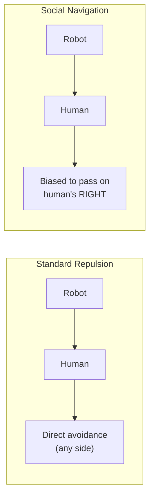

# Social Navigation

The social navigation feature biases the robot to pass on the **human's right side** (i.e., the robot goes left relative to the human). This follows common pedestrian conventions and results in more natural, predictable interactions.

## Overview

When a human is detected, the guidance field around the human boundary is modified by adding a **counter-clockwise (CCW) tangential component** to the normal repulsion gradient. This creates an asymmetric field that encourages the robot to curve around the human's right side rather than taking the shortest path.



## Mathematical Formulation

At each boundary cell near a detected human, the guidance vector is modified:

1. **Compute normal gradient** `(gx, gy)` pointing away from the obstacle
2. **Add CCW tangential component**: `(-gy, gx)` scaled by `social_tangent_bias`
3. **Re-normalize** the result to unit length
4. **Scale** by `dh0_human` (gradient magnitude for humans)

```cpp
// Original gradient (normalized)
float gx = guidance_x[idx];
float gy = guidance_y[idx];

// Add CCW tangent: (-gy, gx)
guidance_x[idx] = gx + social_tangent_bias * (-gy);
guidance_y[idx] = gy + social_tangent_bias * gx;

// Re-normalize
float V = sqrt(guidance_x[idx]^2 + guidance_y[idx]^2);
guidance_x[idx] /= V;
guidance_y[idx] /= V;
```

## Parameters

| Parameter                  | Default | Description                                                                      |
| -------------------------- | ------- | -------------------------------------------------------------------------------- |
| `enable_social_navigation` | `false` | Enable/disable the tangential bias                                               |
| `social_tangent_bias`      | `0.5`   | Strength of the tangential component (0 = no bias, 1 = equal tangent and normal) |
| `dh0_human`                | `1.0`   | Gradient magnitude for human boundaries (stronger than obstacles)                |
| `dh0_obstacle`             | `0.3`   | Gradient magnitude for non-human obstacles                                       |

## Visual Explanation

```
            Normal Only              With Social Nav (CCW bias)

              ↑                           ↗
            ↖ H ↗                       ↑ H →
              ↓                           ↙

        (symmetric)               (biased to human's right)
```

When approaching a human from behind or head-on:

- **Without social nav**: Robot may pass on either side
- **With social nav**: Robot preferentially curves to the human's right

## Triggering Conditions

Social navigation is applied only when **all** conditions are met:

1. `enable_social_navigation` is `true`
2. The boundary cell is near a **human** (detected via `class_map`)
3. Human detection uses a search radius (`robot_kernel_dim / 2`) to ensure all inflated boundary cells around a human receive the bias

## Integration with Human Tracking

The system uses object-level human tracking ([human_tracker.h](file:///home/yangl/semantic-safety/robot_ws/src/include/poisson/human_tracker.h)) to maintain human labels even when:

- The human moves out of camera view
- Brief YOLO detection failures occur

This ensures consistent social navigation behavior as long as the tracked human is within the Poisson grid.

## Configuration

Set parameters in the launch file:

```python
# semantic_safety.launch.py
'enable_social_navigation': True,
'social_tangent_bias': 0.5,  # Adjust for stronger/weaker bias
'dh0_human': 1.0,            # Human repulsion strength
'dh0_obstacle': 0.3,         # Wall/obstacle repulsion
```

Or via command line:

```bash
ros2 launch src semantic_safety.launch.py enable_social_navigation:=true social_tangent_bias:=0.7
```
