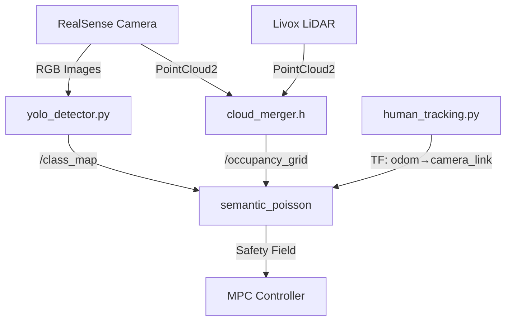

# Semantic Safety Field Pipeline

## Overview

Complete pipeline for semantic-aware safety field generation with YOLO human detection and class-based Poisson solver.

---

## Architecture



---

## Files Modified

| File | Changes |
|------|---------|
| [yolo_detector.py](file:///home/yangl/semantic-safety/robot_ws/src/scripts/yolo_detector.py) | Added `/class_map` publisher (OccupancyGrid) |
| [semantic_poisson.cpp](file:///home/yangl/semantic-safety/robot_ws/src/src/semantic_poisson.cpp) | Brushfire algorithm, class-aware dh0, red human visualization |
| [semantic_safety.launch.py](file:///home/yangl/semantic-safety/robot_ws/src/launch/semantic_safety.launch.py) | Added `dh0_human`, `dh0_obstacle` parameters |

---

## Key Features

### 1. Class Map Publisher (YOLO)
- Projects human bounding boxes to grid cells
- Published as `nav_msgs/OccupancyGrid` on `/class_map`
- Class labels: 0=free, 1=human

### 2. Brushfire Algorithm (C++)
- Expands human labels to connected occupied clusters
- 8-connectivity expansion with max 20 iterations
- Located in `label_human_clusters()`

### 3. Class-Aware Safety Field
```cpp
if (class_map[i*JMAX+j] == 1) {
    local_dh0 = dh0_human;   // Stronger repulsion (default 3.0)
} else {
    local_dh0 = dh0_obstacle; // Normal repulsion (default 1.0)
}
```

### 4. Red Human Visualization
- Human cells overlay in red on the OpenCV Poisson visualization
- Visible when `start_flag=true` (spacebar 3x)

---

## Configuration

### Launch Parameters
```bash
ros2 launch unitree_ros2_poisson_simple semantic_safety.launch.py \
  dh0_human:=3.0 \
  dh0_obstacle:=1.0 \
  camera_fps:=15
```

### Grid Parameters ([poisson.h](file:///home/yangl/semantic-safety/robot_ws/src/include/poisson/poisson.h))
- `IMAX = 100`, `JMAX = 100`
- `DS = 0.05` (5cm resolution)
- Grid covers 5m x 5m area

---

## Performance

| Component | Time |
|-----------|------|
| Occ Map Build | ~2ms |
| Brushfire | <1ms |
| Poisson Solve | ~25-30ms |
| **Total Grid Loop** | ~50-70ms |

---

## Verification

```bash
# Check class_map publishing
ros2 topic hz /class_map

# Check safety field visualization
# Press spacebar 3x in semantic_poisson to enable display

# Verify dh0 parameters loaded
# Look for: "[INFO] dh0_human=3.00, dh0_obstacle=1.00"
```
